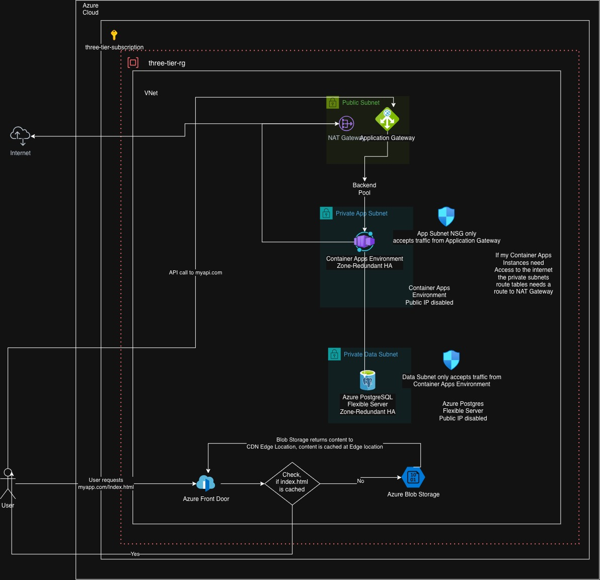

# Terraform Three-Tier Application on Azure

A production-style **three-tier architecture on Azure**, provisioned end-to-end with
**Terraform** and deployed through **GitHub Actions**. The application tier runs on
**Azure Container Apps** behind an **Application Gateway**, with a **PostgreSQL
Flexible Server**-ready data tier and a **Front Door + Blob Storage** frontend —
infrastructure, image builds, and deployment fully automated via OIDC, with no static
cloud credentials anywhere in the pipeline.



This is the Azure counterpart to
[`terraform-three-tier-app`](https://github.com/yasin-96/terraform-three-tier-app),
the same architecture built on AWS. The two repos deliberately implement identical
application logic on both clouds — see [AWS ↔ Azure](#aws--azure) for the concept
translation between them.

---

## Architecture

The stack follows the classic three-tier separation, with each tier isolated in its
own subnet:

- **Presentation tier** — a static React frontend hosted in **Blob Storage** (static
  website) and served through **Azure Front Door**. Requests hit a Front Door edge
  node; on a cache miss the content is fetched from Blob Storage, cached at the edge,
  and returned to the client — end-to-end over HTTPS.
- **Application tier** — a Spring Boot service running as an **Azure Container App**,
  in an **internal** Container Apps Environment inside the app subnet (no public
  ingress at the environment level). An **Application Gateway** in the public subnet
  is the only entry point, terminating TLS with a certificate sourced from
  **Key Vault** and forwarding to the Container App over HTTPS — the Container Apps
  ingress terminates TLS again and proxies internally to the container on port 8080.
  Container images live in a private **Azure Container Registry**, pulled via a
  **user-assigned managed identity** (no registry credentials anywhere).
- **Data tier** — a dedicated, delegated **data subnet** reserved for a
  **PostgreSQL Flexible Server** with zone-redundant high availability, reachable only
  from the app subnet.

**Networking:** the VNet is split into three subnets — `public` (Application Gateway,
NAT Gateway), `app` (Container Apps Environment, delegated to
`Microsoft.App/environments`), and `data` (reserved for PostgreSQL). Azure has no
Internet Gateway concept; inbound/outbound exposure is controlled entirely through
**Network Security Groups** and explicit public IP assignment per resource, not
subnet-level routing. A **NAT Gateway** gives the app subnet outbound internet access
without exposing it publicly. A subnet in Azure spans the whole region — there is no
per-Availability-Zone subnet as in AWS; zone redundancy is instead a property of the
resource itself (Container Apps Environment, PostgreSQL), not the network layout.

**DNS:** because the Container Apps Environment is internal, its ingress hostname only
resolves inside the VNet. A dedicated **Private DNS Zone** (matching the environment's
auto-generated domain) is linked to the VNet so the Application Gateway can resolve
the backend hostname and route to it.

---

## Stack

| Layer | Technology |
|---|---|
| IaC | Terraform (HCL) |
| Compute | Azure Container Apps (internal environment, user-assigned identity) |
| Load balancing | Application Gateway v2 (HTTP + HTTPS listeners, Key Vault-backed TLS) |
| Frontend delivery | Azure Front Door (Standard) + Blob Storage static website |
| Database | Azure PostgreSQL Flexible Server (zone-redundant HA — data subnet ready) |
| Container registry | Azure Container Registry (RBAC pull via managed identity) |
| Secrets | Azure Key Vault (TLS certificate; never committed to the repo) |
| Networking | VNet, 3 subnets, NSGs, NAT Gateway, Private DNS Zone |
| State management | Remote state in **Azure Storage**, locking via built-in blob lease |
| CI/CD | GitHub Actions, OIDC (Workload Identity Federation) — no static secrets |
| Application | Java / Spring Boot backend, TypeScript / React frontend |

---

## Repository layout

```
.
├── .github/workflows/       CI/CD pipelines (see below)
├── backend/                 Spring Boot application + Dockerfile
├── frontend/                TypeScript/React application (Vite)
└── infra/
    ├── bootstrap/           State backend + OIDC identity (applied once, locally)
    └── app/
        ├── main.tf          Root module: resource group + module wiring
        ├── variables.tf
        └── modules/
            ├── networking/  VNet, subnets, NSGs, NAT Gateway
            ├── app-layer/   Container Apps, Application Gateway, ACR, Key Vault, DNS
            └── frontend/    Storage static website + Front Door
```

---

## CI/CD pipelines

Three GitHub Actions workflows, each triggered by changes to its own path and
authenticated to Azure via **OIDC** (`azure/login`) — no client secrets or account
keys stored anywhere:

**1. Infra Deployment** (`infra.yml`) — on changes to `infra/app/**`, runs
`terraform init / plan / apply` against the remote state backend.

**2. Backend Deployment** (`build-deploy-backend.yml`) — on changes to `backend/**`,
builds the Spring Boot JAR, builds and pushes a container image to ACR tagged with
the commit SHA, and updates the Container App to that image via
`az containerapp update`.

**3. Frontend Deployment** (`build-deploy-frontend.yml`) — on changes to
`frontend/**`, builds the React app, uploads the build output to the `$web` blob
container, and purges the Front Door cache so the new version is served immediately.

Infrastructure and application deployments are deliberately **separate pipelines**
with independent lifecycles — the app is deployed far more often than the
infrastructure changes, and neither should block or duplicate work for the other.
See [Design decisions](#design-decisions).

---

## Remote state & bootstrap

Terraform state lives in an **Azure Storage Account**, with locking handled natively
via blob leases (no separate lock table needed, unlike S3 + DynamoDB on AWS).

The bootstrap (`infra/bootstrap/`) creates the state storage account and the OIDC
app registration + federated identity credential that the pipelines authenticate
with. It is **applied once, locally** — not from a pipeline. This isn't an oversight:
the pipeline's identity is *created by* the bootstrap, so the bootstrap can't
authenticate via a pipeline that doesn't exist yet. Role assignments (granting the
pipeline identity `Contributor` on the resource groups, `AcrPush`/`AcrPull`, Key
Vault access) are likewise applied with an elevated, interactively-logged-in account
— a `Contributor`-scoped identity cannot grant roles to itself
(`Microsoft.Authorization/roleAssignments/write` requires `Owner` or
`User Access Administrator`), which is a deliberate Azure guardrail against privilege
escalation, not a limitation to work around.

```hcl
# infra/app/main.tf
terraform {
  backend "azurerm" {
    resource_group_name  = "rg-tfstate"
    storage_account_name = "sttfstatethreetier"
    container_name        = "tfstate"
    key                    = "app/terraform.tfstate"
  }
}
```

---

## Getting started

### Prerequisites

- Terraform
- Azure CLI, logged in (`az login`) with Contributor on the target subscription
- Docker (for local backend image builds)
- Node.js 20+ (frontend), Java 21 + Maven (backend)

### Provision the infrastructure

```bash
cd infra/bootstrap
terraform init && terraform apply     # once, locally — see Remote state & bootstrap

cd ../app
terraform init
terraform plan -var="cert_password=<your-pfx-password>"
terraform apply -var="cert_password=<your-pfx-password>"
```

The Application Gateway's HTTPS listener expects a `.pfx` certificate at
`infra/app/modules/app-layer/cert.pfx` (git-ignored — never committed) — generate one
for local testing with:

```bash
openssl req -x509 -newkey rsa:2048 -keyout key.pem -out cert.pem -days 365 -nodes \
  -subj "/CN=<your-gateway-dns-label>.<region>.cloudapp.azure.com"
openssl pkcs12 -export -out cert.pfx -inkey key.pem -in cert.pem
```

### Deploy the application

Application images and frontend assets are built and deployed automatically by the
GitHub Actions workflows on changes to `backend/` or `frontend/`. To do it locally:

```bash
# backend
az acr login --name acrthreetier
docker build -t acrthreetier.azurecr.io/backend:local backend/
docker push acrthreetier.azurecr.io/backend:local
az containerapp update --name backend-app --resource-group three-tier-rg \
  --image acrthreetier.azurecr.io/backend:local

# frontend
cd frontend && npm ci && npm run build
az storage blob upload-batch --account-name stfrontendthreetier \
  --destination '$web' --source dist --auth-mode login --overwrite
```

---

## AWS ↔ Azure

Building the same architecture twice surfaced where the clouds genuinely differ in
concept, not just naming. The mapping below is the practical result:

| Concept | AWS | Azure |
|---|---|---|
| Network container | VPC | VNet |
| Subnet scope | one Availability Zone each | spans the whole region |
| Public internet ingress | Internet Gateway (routed) | no equivalent — controlled via NSG + public IP per resource |
| Outbound-only internet | NAT Gateway | NAT Gateway (same concept) |
| Compute (containers) | ECS Fargate | Container Apps |
| L7 load balancer | Application Load Balancer | Application Gateway |
| L4 load balancer | Network Load Balancer | Azure Load Balancer |
| Global CDN / edge | CloudFront | Front Door (classic Azure CDN deprecated Oct 2025) |
| Object/static storage | S3 | Blob Storage (+ static website feature) |
| Container registry | ECR | Container Registry (ACR) |
| Managed DB HA | RDS Multi-AZ | Flexible Server, zone-redundant HA |
| Identity for workloads | IAM role (OIDC federated) | Managed Identity (User- or System-Assigned) |
| Secrets/certs | Secrets Manager / ACM | Key Vault |
| Terraform state locking | S3 + DynamoDB table | Storage Account (built-in blob lease, no second resource) |
| GitHub Actions auth | OIDC via `aws-actions/configure-aws-credentials` | OIDC via `azure/login` + Workload Identity Federation |

---

## Design decisions

- **Terraform owns the shell, the pipeline owns the running version.** The Container
  App's `image` field is set to a placeholder at creation time (a real image must
  exist for the resource to provision at all) and then explicitly excluded from
  Terraform's management with `lifecycle { ignore_changes = [...] }`. The backend
  pipeline updates the live image via `az containerapp update`; the next
  `terraform apply` never rolls it back. This mirrors the GitOps split between
  infrastructure and application deployment used in the companion Kubernetes project.
- **Infra and app pipelines are independent, not chained.** Rather than forcing
  ordering with job `needs:` across all three workflows, infra and app changes are
  merged as separate, sequential commits when they both need to land — this keeps
  each pipeline fast and matches how infrastructure and application code actually
  change at different cadences in practice.
- **Certificates never touch the repository.** The `.pfx` is generated locally,
  `.gitignore`'d, imported into Key Vault once, and from then on referenced by the
  Application Gateway via a user-assigned managed identity with `Get`-only access —
  no certificate material lives in Terraform state files, CI logs, or version
  control.
- **Least-privilege identities per purpose**, not one shared principal: a
  `Contributor`-scoped pipeline identity for infrastructure, a separate `AcrPush`
  grant for image pushes, an `AcrPull`-only identity for the Container App, and a
  `Key Vault Get`-only identity for the gateway — each with the minimum needed for
  its one job.

---

## Challenges & solutions

Debugging notes from getting an Application Gateway to route correctly into an
internal Container Apps Environment — a combination that has few well-documented
working examples:

- **Backend health stuck on `Unknown`** — the Application Gateway couldn't resolve
  the Container App's ingress hostname. Cause: the Container Apps Environment gets a
  randomly generated domain suffix on every creation, and the Private DNS Zone had
  been created with a hardcoded name from an earlier run. Fix: reference the zone
  name and the A record's target IP dynamically
  (`azurerm_container_app_environment.main.default_domain` /
  `.static_ip_address`) so a zone recreation always tracks the current environment.
- **Backend health `Unhealthy`, 404 "stopped or does not exist"** — despite correct
  DNS resolution and a running container. Root cause: on an *internal* Container Apps
  Environment, `external_enabled` on the Container App doesn't mean "publicly
  reachable" — it controls whether the app gets a VNet-wide-resolvable hostname
  (without `.internal.`) or one resolvable only within the environment itself (with
  `.internal.`). The internal-only hostname wasn't being routed to correctly through
  the gateway; switching to `external_enabled = true` fixed it while the app remains
  fully unreachable from the public internet (the environment itself has no public
  load balancer).
- **404 with a valid connection** — the health probe's default path (`/`) has no
  handler in the Spring Boot app. Fixed by pointing the probe at
  `/actuator/health`, the dedicated health endpoint Spring Boot Actuator exposes.
- **Backend HTTP settings: HTTP vs. HTTPS** — the container itself listens on plain
  HTTP:8080, but the Container Apps ingress *always* terminates TLS on 443 for
  inbound traffic, regardless of the container's own port. The gateway's backend
  HTTP settings had to target `443`/`Https` (with `pick_host_name_from_backend_address`
  and a matching probe host), not the container's own port/protocol.
- **Mixed Content blocking the browser** — once the frontend moved to HTTPS via
  Front Door, the browser silently blocked `fetch()` calls to the HTTP-only gateway
  API. Fixed by adding a second, HTTPS listener to the Application Gateway with a
  certificate sourced from Key Vault (see [Design decisions](#design-decisions)).
- **`MissingSubscriptionRegistration` on first Container Apps deploy** — Azure
  resource providers (`Microsoft.App`, `Microsoft.OperationalInsights`) must be
  registered per subscription before first use: `az provider register --namespace ...`.
- **Chicken-and-egg Terraform backend** — the bootstrap creates the storage account
  it also uses as its own backend. Resolved with the standard pattern: apply once
  with the `backend` block commented out (local state), then uncomment and run
  `terraform init -migrate-state`.
- **GitHub Actions OIDC failing with `AADSTS700213`** — repositories created after
  July 2026 emit an *immutable* subject claim that embeds numeric owner/repository
  IDs (`repo:<owner>@<ownerId>/<repo>@<repoId>:ref:...`) instead of the classic
  name-based one. The federated credential's `subject` has to match this exact
  format — visible via the repo's Settings → Actions → General → OIDC customization
  panel.
- **Classic Azure CDN could not be provisioned** — deprecated for new resources as
  of October 1, 2025. Rebuilt the frontend delivery layer on **Azure Front Door
  Standard** (`azurerm_cdn_frontdoor_*` resources) instead, which also brought
  built-in HTTP→HTTPS redirect for free.

---

## What this demonstrates

- **Infrastructure as Code across two clouds** — the same application architecture
  reasoned through and rebuilt on Azure after AWS, translating concepts rather than
  copying syntax (see [AWS ↔ Azure](#aws--azure))
- **Zero static cloud credentials** — every pipeline authenticates via OIDC /
  Workload Identity Federation; no account keys, client secrets, or connection
  strings in CI configuration
- **Defense-in-depth network isolation** — public ingress limited to the
  Application Gateway; the Container Apps Environment and database subnet have no
  direct internet exposure, enforced via NSGs scoped to the specific upstream subnet
  rather than open ranges
- **Secrets management done right** — TLS certificate held in Key Vault, accessed by
  the gateway via managed identity; never a file in source control
- **Least-privilege identity design** — a distinct managed identity and role
  assignment per workload and purpose, not a single broadly-scoped principal
- **GitOps-style separation of infrastructure and application lifecycle** — Terraform
  provisions the platform; independent CI/CD pipelines own what's actually running,
  with `lifecycle.ignore_changes` preventing one from clobbering the other
- **Real-world Azure troubleshooting** — provider registration, private DNS
  resolution for internal Container Apps, Application Gateway health probing, and
  current platform changes (immutable OIDC subjects, CDN deprecation) all debugged
  and documented as they were encountered, not glossed over
